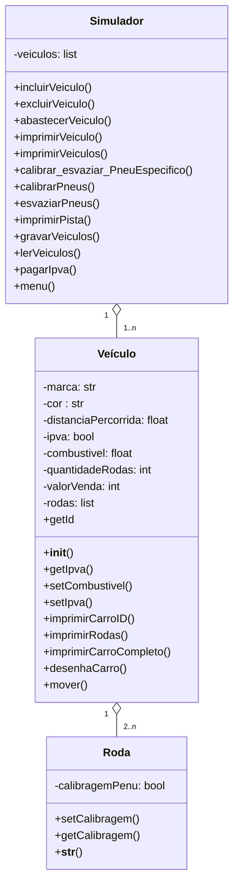

# Trabalho Prático - Parte 1  

O seguinte trabalho tem como objetivo fazer um simulador de corridas utilizando o conceito de classes e objetos. Foi desenvolvido em Python3 para a disciplina de Programação Orientada a Objetos do 4º período de Engenharia da Computação.

## Dicas de Tipo
As dicas de tipo são uma boa prática em programação em Python. Elas servem como um modo de incluir anotações sobre os tipos esperados de variáveis, parâmetros e retorno em funções.  
Exemplo:
> def somar(a,b): 
>&nbsp;&nbsp;&nbsp;&nbsp;&nbsp;return a + b 

Utilizando dicas de tipo
> def somar(a: int, b: int) -> int: 
> &nbsp;&nbsp;&nbsp;&nbsp;&nbsp;return a + b 

**Importante** lembrar que o Python não faz nenhuma verificação para saber se as dicas de tipo estão corretas. Portanto, caso fossem inseridos floats na função somar, ela ainda seria executada.

## Repetições
Alguns comandos se repente exaustivamente no código, como por exemplo:
> if len(self.__veiculos) != 0

Como veiculos é atributo do tipo *list* a função *len()* apenas retorna o seu tamanho para então verificar se é diferente de 0.

> time.sleep(n)

Apenas para o programa aguards n segundos antes de executar o próximo comando.

>for i in range(len(self.__veiculos)): 
>&nbsp;&nbsp;&nbsp;&nbsp;&nbsp; if id == self.__veiculos[i].getId():

Faz um *for* com o tamanho da lista de carros, e verifica se ID digitado pelo usuário é condizendo com o id de algum veiculo existente.

# Arquivos
##  Roda.py
Dentro do arquivo Roda.py será a definição da classe roda. Esta classe possui apenas o atributo "calibragemPneu", o método setCalibragem para mudar o estado da roda e o método getCalibragem para retorna o estado da Roda.

## Veículo.py
Este arquivo é para as definições da classe veículo. Esta classe possuí diversas atributos, porém a única que será definida pelo usuário será a marca do carro. 

## Simulador.py
Nesse arquivo será instânciado os veículos com suas rodas e um menu será aberto para fazer alterações em seus atributos. Também é possívlel mover-se com os carros na pista de corrida. 

## util.py
Algumas funções que não pertencem necessariamente a nenhuma classe porém são chamadas diversas vezes em simulador.py.

## main.py
Arquivo principal onde será executado a uma instância da classe simulador.

### Equivalências
Vale pontuar algumas equivalências entre a linguagem Python e Java

|                | Python                         |Java           |
|----------------|-------------------------------|-----------------------------|
|Refererência a classe | `self`|`this`|
|Converter string para int |`int()`            |`Integer.parseInt()`|
|Função / Métodos|`def funcao()`| `public static void funcao()`|
|Sobrecarga de métodos| Não funciona pois o Python executará a versão mais 'recente' da função | `public void alterarData(int D) `  ` public void alterarData(int d, int m)`|
| static | usar decorador @staticmethod  `@staticmethod`  `def somar(a, b)`| `public static int somar()`|
Ler do terminal|`input()`  `int(input)`   `float(input)`| `scanner.nextLine()`  `scanner.nextInt()`  `scanner.nextDouble()`|

